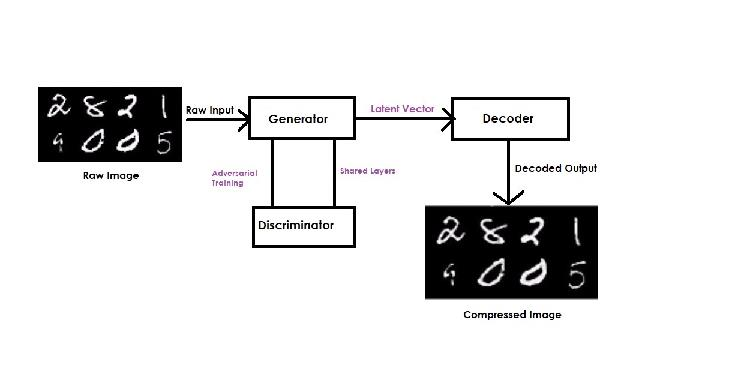

# gan-compression

TensorFlow / TensorLayer implementation of image compression technique which is  stabilized by intergrating a Generative Adversarial Network.

Looking for Text to Image Synthesis ? [click here](https://github.com/zsdonghao/text-to-image)

* [Brandon Amos](http://bamos.github.io/) wrote an excellent [blog post](http://bamos.github.io/2016/08/09/deep-completion/) and [image completion code](https://github.com/bamos/dcgan-completion.tensorflow)
* *To avoid the fast convergence of D (discriminator) network, G (generator) network is updated twice for each D network update, which differs from original paper.*

## Architecture

## Prerequisites

- Python 2.7 or Python 3.3+
- [TensorFlow==1.0+](https://www.tensorflow.org/)
- [TensorLayer==1.4+](https://github.com/zsdonghao/tensorlayer)

## Usage

First, download images to `data/celebA`:

    $ python download.py celebA		[202599 face images]

Second, train the GAN:

    $ python train_compression.py
